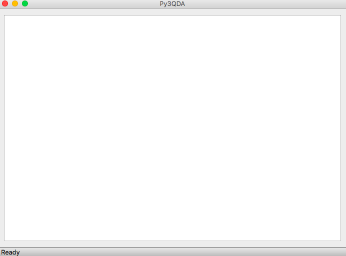

# Py3QDA Project


## PyQDA

PyQDA in the directory of Py2QDA-0.1.1 is a Python-clone of [RQDA](http://rqda.r-forge.r-project.org/) which was forked from https://github.com/ccbogel/PyQDA


## Py3QDA

PyQDA has been ported to Python 3.6 and PyQt5, and I renamed it to Py3QDA (in the directory of Py3QDA-0.1)


Few new features, such as case profile matrix, have been added to Py3QDA.


### Installation of Py3QDA

1. Install Python 3.6+ and PyQt5 module

   The recommended way is to install [Anaconda (Python 3.6 version)](https://www.anaconda.com/download), for Chinese users can download it from the [mirror](https://mirrors.tuna.tsinghua.edu.cn/anaconda/archive/) of Tsinghua University.

   Another way is to install [WinPython](http://winpython.github.io/) (The one with Python 3.6+ and QT5)

2. Download [PyQDA](https://github.com/Ronggui/PyQDA/archive/master.zip) and unizp it.

3. Launch terminal (for Mac) or cmd (for Windows), and change the working directory to path/of/PyQDA/Py3QDA-0.1 (say ```$cd ~/Downlods/PyQDA-master/Py3QDA-0.1``` if a mac user download it to the Downloads directory), run the following command

   ```bash
   $python setup.py install
   ```

4. Launch Py3QDA by running the following command

   ```bash
   $py3qda
   ```
   Then you can see the main screen of the program.

   

